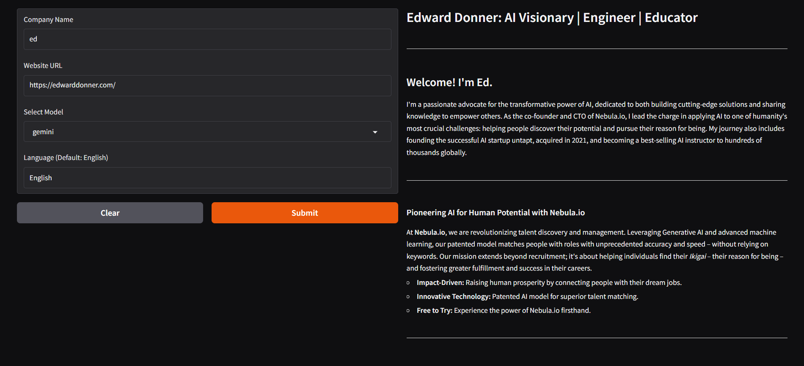
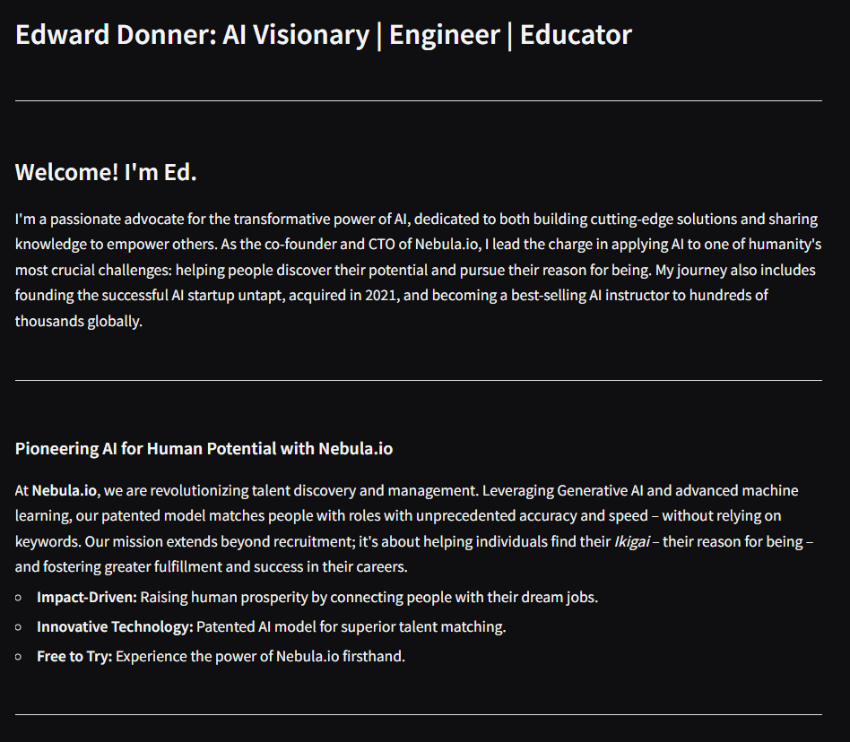
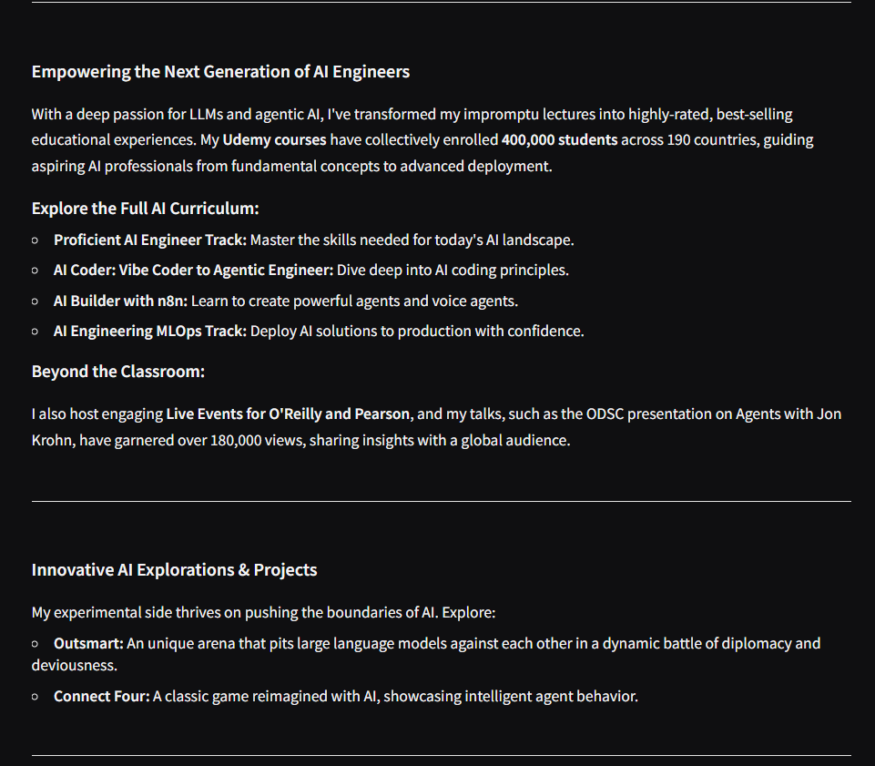
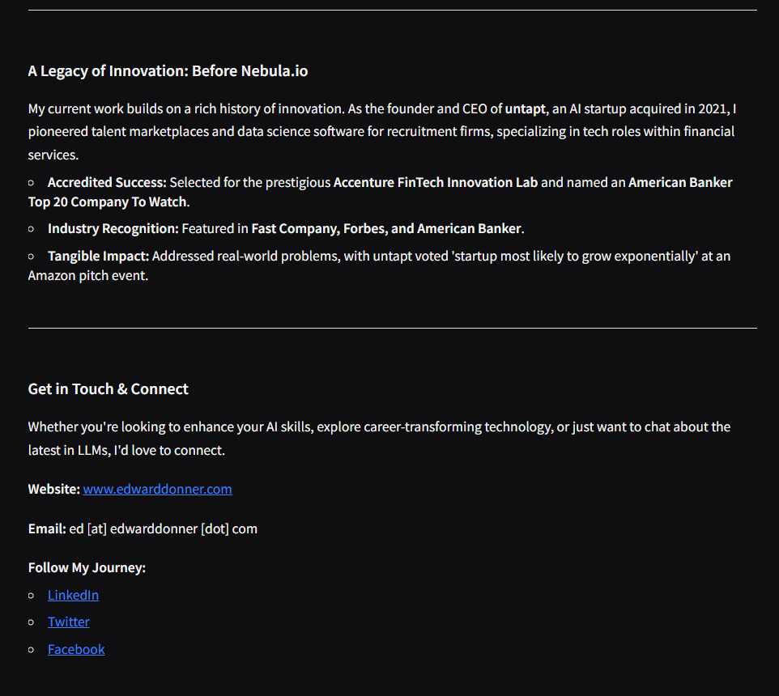

# 🧾 AI Brochure Generator

## 🚀 Overview

An AI-powered application that generates professional company brochures from a website using Large Language Models like **Gemini** and **LLaMA (via Ollama)**.

The app intelligently scrapes website content, identifies relevant pages (About, Services, Careers, etc.), and converts them into a structured, well-formatted brochure in Markdown.

---

## ✨ Features

* 🌐 Automatic website scraping
* 🤖 Multi-model support (Gemini + Ollama)
* ⚡ Real-time streaming responses
* 🌍 Multi-language brochure generation
* 🧩 Modular and scalable architecture

---

## 🛠 Tech Stack

* Python
* Gradio (UI)
* BeautifulSoup (Web Scraping)
* OpenAI-compatible APIs
* Ollama (Local LLM runtime)

---

## 📁 Project Structure

```
AI_brochure_project/
│
├── app/
│   ├── main.py
│   ├── router.py
│   ├── models/
│   ├── utils/
│
├── assets/
│   ├── ui.png
│   ├── output1.png
│   ├── output2.png
│   ├── output3.png
│
├── requirements.txt
├── README.md
├── .gitignore
├── .env.example
```

---

## ⚙️ Setup Instructions

### 1. Clone the repository

```bash
git clone <your-repo-link>
cd AI_brochure_project
```

### 2. Install dependencies

```bash
pip install -r requirements.txt
```

### 3. Setup environment variables

Create a `.env` file in the root directory:

```
GOOGLE_API_KEY=your_api_key_here
```

### 4. Run Ollama (for local model support)

```bash
ollama serve
```

(Optional: pull model if not installed)

```bash
ollama run llama3.2
```

### 5. Start the application

```bash
python app/main.py
```

---

## ▶️ Usage

1. Enter the company name
2. Enter the website URL
3. Select the model (Gemini or Ollama)
4. Choose language (optional)
5. Generate brochure 🎉

---

## 📸 Demo

### 🔹 Application UI


---

### 🔹 Generated Outputs




---

## ⚠️ Notes

* Website content is truncated to avoid token limits
* Ollama must be running locally for LLaMA support
* `.env` file should never be uploaded (contains API keys)

---

## 🔮 Future Improvements

* Export brochures as PDF
* Add frontend (React)
* Improve design and layout
* Add caching for faster responses

---

## 📄 License

This project is open-source and available under the MIT License.
